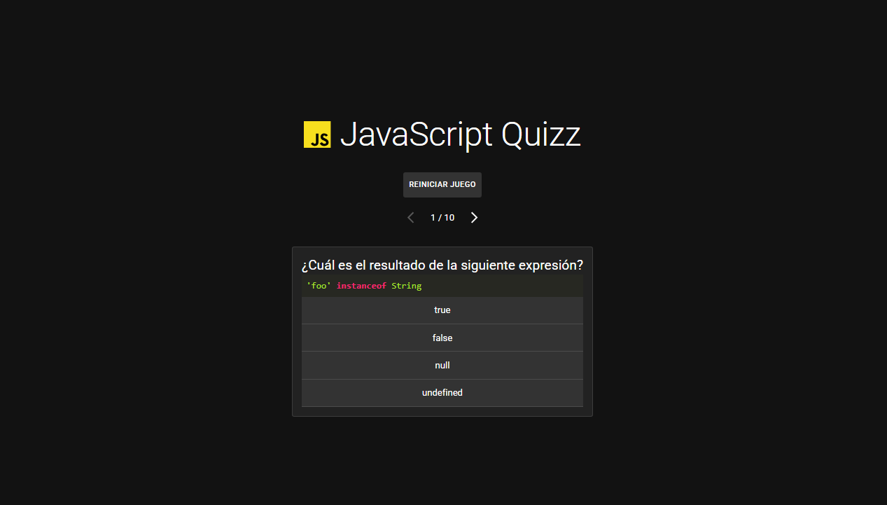
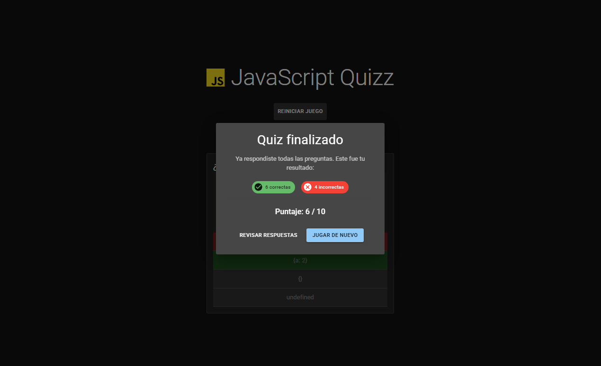
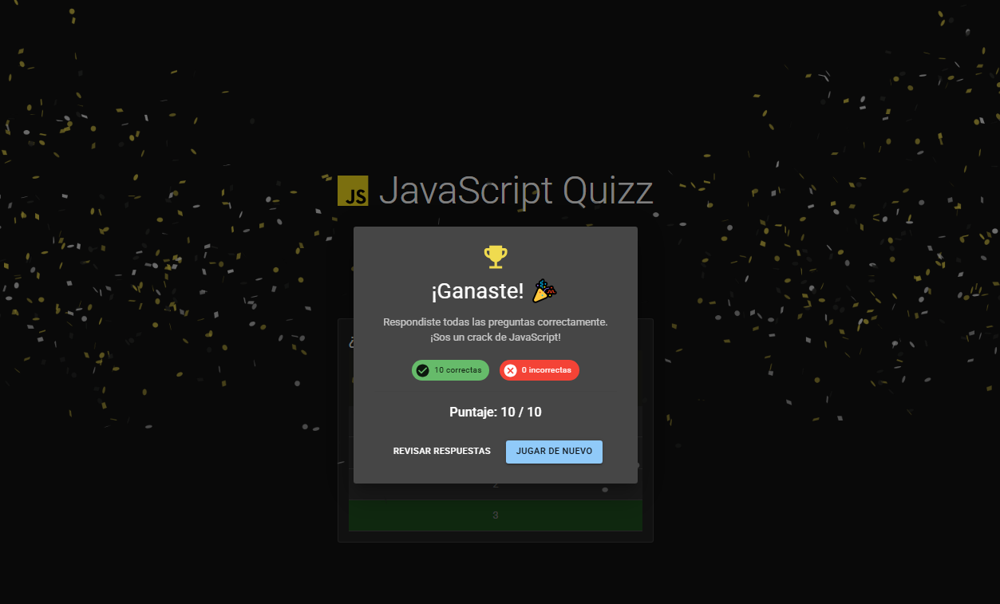

# JS Quiz

Juego de preguntas y respuestas sobre JavaScript, con seguimiento de puntaje y feedback visual en tiempo real.

## Descripción

JS Quiz plantea una serie de preguntas con fragmentos de código JavaScript y cuatro opciones de respuesta. A medida que el usuario responde, la pregunta se marca como correcta o incorrecta, y al completar todas las preguntas se muestra un modal de resultados con el resumen final. Si el puntaje es perfecto, se dispara una animación de confetti.

## Tech stack

- **Frontend:** React, TypeScript, Vite
- **Estado:** Zustand (con persistencia en `localStorage`)
- **UI:** Material UI (MUI)
- **Extras:** react-syntax-highlighter (resaltado de código), canvas-confetti
- **Infraestructura:** Vercel · deploy del proyecto

## Screenshots

### Interfaz del juego

### Modal de resultados al finalizar el juego

### Modal si un usuario responde todas las preguntas correctas

## URL pública

🌐 [learnjs-quiz.vercel.app](https://learnjs-quiz.vercel.app/)

## Créditos

Proyecto construido durante el curso de React de [midudev](https://www.youtube.com/@midudev), como parte de la práctica del [playlist de React](https://www.youtube.com/playlist?list=PLUofhDIg_38q4D0xNWp7FEHOTcZhjWJ29).
